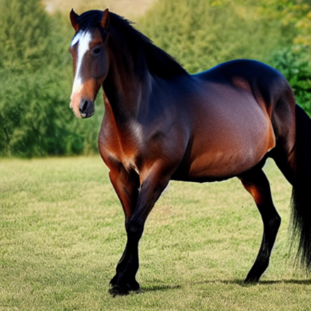
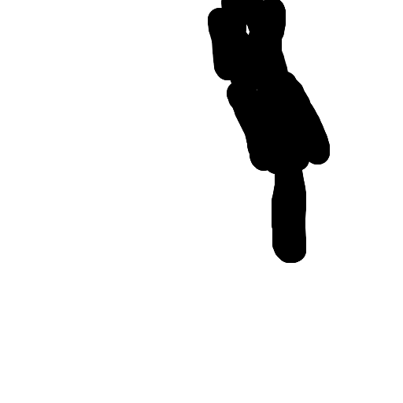
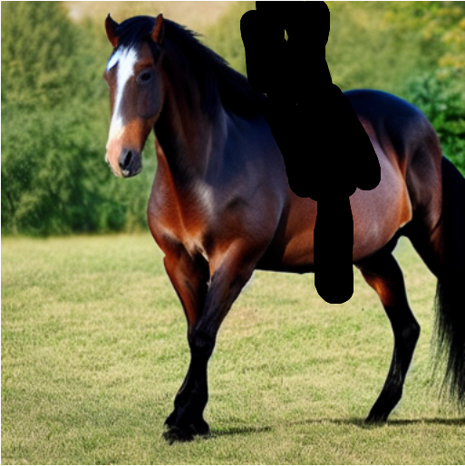

# OnnxStack.StableDiffusion - Onnx Stable Diffusion Services for .NET Applications

`OnnxStack.StableDiffusion` is a library that provides higher-level Stable Diffusion services for use in .NET applications. It offers extensive support for features such as dependency injection, .NET configuration implementations, ASP.NET Core integration, and IHostedService support.


###  **Prompt**

Stable Diffusion models take a text prompt and create an image that represents the text.

*Example:*
`
High-fashion photography in an abandoned industrial warehouse, with dramatic lighting and edgy outfits, detailed clothing, intricate clothing, seductive pose, action pose, motion, beautiful digital artwork, atmospheric, warm sunlight, photography, neo noir, bokeh, beautiful dramatic lighting, shallow depth of field, photorealism, volumetric lighting, Ultra HD, raytracing, studio quality, octane render
`

###  **Negative Prompt**

A negative prompt can be provided to guide the inference to exclude in calculations

*Example:*

`
painting, drawing, sketches, monochrome, grayscale, illustration, anime, cartoon, graphic, text, crayon, graphite, abstract, easynegative, low quality, normal quality, worst quality, lowres, close up, cropped, out of frame, jpeg artifacts, duplicate, morbid, mutilated, mutated hands, poorly drawn hands, poorly drawn face, mutation, deformed, blurry, glitch, deformed, mutated, cross-eyed, ugly, dehydrated, bad anatomy, bad proportions, gross proportions, cloned face, disfigured, malformed limbs, missing arms, missing legs fused fingers, too many fingers,extra fingers, extra limbs,, extra arms, extra legs,disfigured,
`

### **Schedulers**

Many different scheduler algorithms can be used for this computation, each having its pro- and cons. 
So far `OnnxStack.StableDiffusion` as included `LMS Discrete`, `Euler Ancestral`, `DDPM`, `DDIM`, and `KDPM2` options with more in the works.

*Example:*
| LMS Scheduler | Euler Ancestral Scheduler | DDPM Scheduler |
| :--- | :--- | :--- |
 |  | |

     Seed: 624461087     GuidanceScale: 8     NumInferenceSteps: 22

### **Text To Image**
Text To Image Stable Diffusion is a powerful machine learning technique that allows you to generate high-quality images from textual descriptions. It combines the capabilities of text understanding and image synthesis to convert natural language descriptions into visually coherent and meaningful images

| Input Text | Output Image | Diffusion Steps |
| :--- | :--- | :--- |
 |  | |

### **Image To Image**
Image To Image Stable Diffusion is an advanced image processing and generation method that excels in transforming one image into another while preserving the visual quality and structure of the original content. Using stable diffusion, this technique can perform a wide range of image-to-image tasks, such as style transfer, super-resolution, colorization, and more

| Input Image | Output Image | Diffusion Steps |
| :--- | :--- | :--- |
 |  | |

```
   Prompt: Dog wearing storm trooper helmet, head shot
```

### **Image Inpainting**
Image inpainting is an image modification/restoration technique that intelligently fills in missing or damaged portions of an image while maintaining visual consistency. It's used for tasks like photo restoration and object removal, creating seamless and convincing results.

In the below example we use a simple mask image + prompt to add a rider to the horse
The black part of the mask will be used buy the process to generate new content, in this case the rider

| Input Image | Mask Image | Masked Image | Result
| :--- | :--- | :--- | :--- |
 |  | | |

```
   Prompt: Rider on horse
```


## **Realtime Stable Diffusion**
Realtime stable diffusion is a process where the results are constantly rendered as you are working with the image or changing the settings, This can be fantastic if you are creating new artworks or editing existing images.

Performance will depend on hardware and models selected, but for `Latent Consistency Models` you can get up to 4fps with a 3090 :)

### Text To Image
https://user-images.githubusercontent.com/4353684/285347887-99db7f37-cff4-48b6-805b-3ca55e8f0c3a.mp4

### Image To Image
https://user-images.githubusercontent.com/4353684/285348410-c19a2111-6745-4f01-8400-d137d40180fe.mp4

### Image Inpaint 
https://user-images.githubusercontent.com/4353684/285347894-9d044d7d-7c22-4379-8187-9cf7b9cac89c.mp4

### Paint To Image 
https://user-images.githubusercontent.com/4353684/285347896-8da6709b-fea6-4cd4-ba65-ec692401f475.mp4

https://user-images.githubusercontent.com/4353684/285547207-3a7ea067-fcbf-47f0-9372-fafa94d301f7.mp4


## ONNX Model Download
You will need an ONNX compatible model to use, Hugging Face is a great place to download the Stable Diffusion models

- [OpenJourney V4](https://huggingface.co/TheyCallMeHex/OpenJourney-V4-ONNX)
- [DreamLike PhotoReal 2.0](https://huggingface.co/TheyCallMeHex/DreamLike-PhotoReal-2.0-ONNX)
- [CyberPunk Anime Diffusion](https://huggingface.co/TheyCallMeHex/Cyberpunk-Anime-Diffusion-ONNX)
- [InkPunk Diffusion](https://huggingface.co/TheyCallMeHex/Inkpunk-Diffusion-ONNX)
- [Mo-Di Diffusion](https://huggingface.co/TheyCallMeHex/Mo-Di-Diffusion-ONNX)
- [epiCRealism](https://huggingface.co/TheyCallMeHex/epiCRealism-ONNX)
- [Comic Diffusion](https://huggingface.co/TheyCallMeHex/Comic-Diffusion-ONNX)
- [Redshift Diffusion](https://huggingface.co/TheyCallMeHex/Redshift-Diffusion-ONNX)


## Resources
- [Hugging Face Stable Diffusion Blog](https://huggingface.co/blog/stable_diffusion)
- [ONNX Runtime tutorial for Stable Diffusion in C#](https://onnxruntime.ai/docs/tutorials/csharp/stable-diffusion-csharp.html)


## Reference
This work is based on the original C# implementation of Stable Diffusion by Cassie Breviu here: [Stable Diffusion with C# and ONNX Runtime](https://github.com/cassiebreviu/stablediffusion).