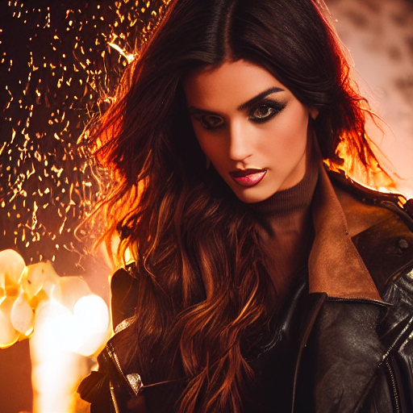
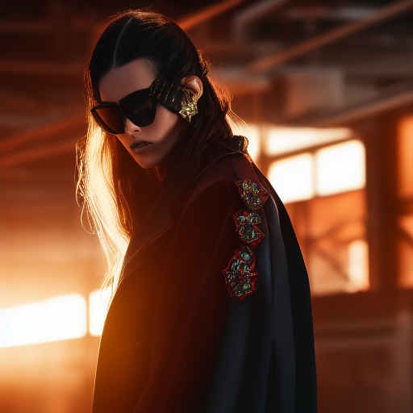
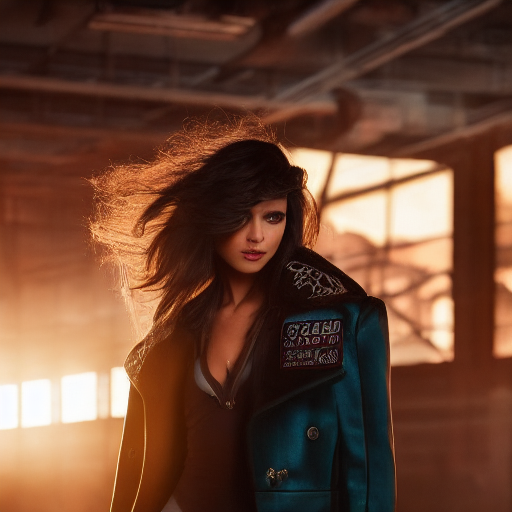
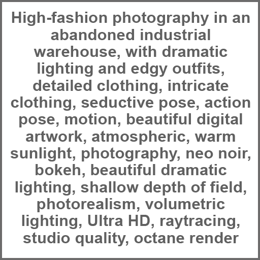
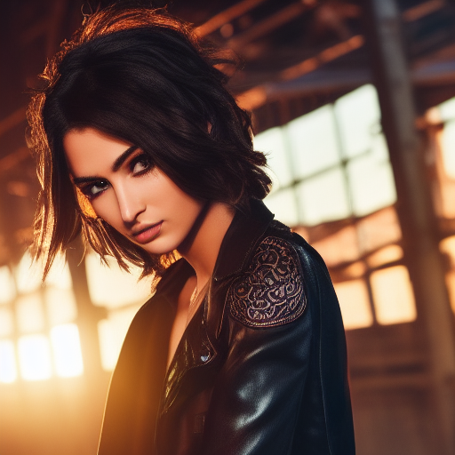
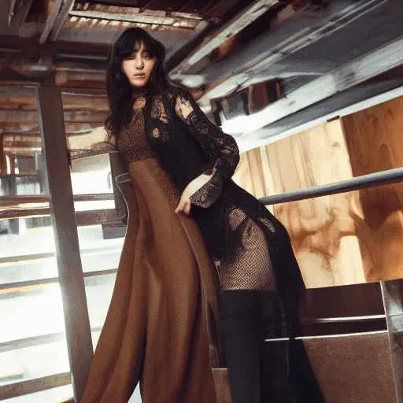
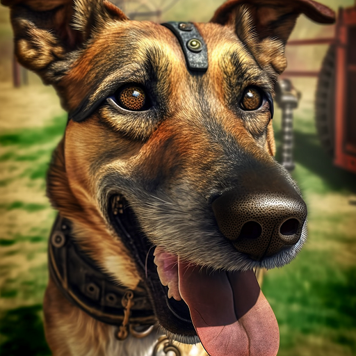
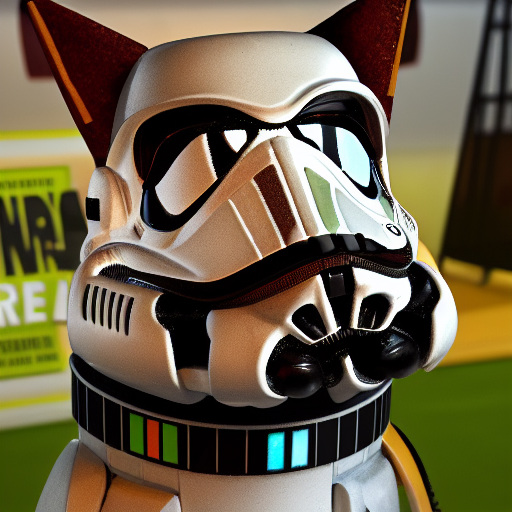

<p align="center" width="100%">
    
</p>


[](https://www.nuget.org/packages/OnnxStack.Core)

[](https://www.nuget.org/packages/OnnxStack.StableDiffusion)


### Welcome to OnnxStack!
OnnxStack is a library that provides higher-level services and integrations for .NET applications, enhancing the functionality and versatility of the `ONNX Runtime` and `Microsoft ML` projects, offering a comprehensive solution that empowers developers to build, deploy, and execute machine learning models seamlessly in .NET environments, unlocking a world of possibilities for intelligent applications.


# Projects

## **[OnnxStack.StableDiffusion](OnnxStack.StableDiffusion/README.md)**
Inference Stable Diffusion with C# and ONNX Runtime

###  **Prompt**

Stable Diffusion models take a text prompt and create an image that represents the text.

*Example:*
`
High-fashion photography in an abandoned industrial warehouse, with dramatic lighting and edgy outfits, detailed clothing, intricate clothing, seductive pose, action pose, motion, beautiful digital artwork, atmospheric, warm sunlight, photography, neo noir, bokeh, beautiful dramatic lighting, shallow depth of field, photorealism, volumetric lighting, Ultra HD, raytracing, studio quality, octane render
`

###  **Negative Prompt**

A negative prompt can be provided to guide the inference to exclude in calculations

*Example:*

`
painting, drawing, sketches, monochrome, grayscale, illustration, anime, cartoon, graphic, text, crayon, graphite, abstract, easynegative, low quality, normal quality, worst quality, lowres, close up, cropped, out of frame, jpeg artifacts, duplicate, morbid, mutilated, mutated hands, poorly drawn hands, poorly drawn face, mutation, deformed, blurry, glitch, deformed, mutated, cross-eyed, ugly, dehydrated, bad anatomy, bad proportions, gross proportions, cloned face, disfigured, malformed limbs, missing arms, missing legs fused fingers, too many fingers,extra fingers, extra limbs,, extra arms, extra legs,disfigured,
`

### **Schedulers**

Many different scheduler algorithms can be used for this computation, each having its pro- and cons. 
So far `OnnxStack.StableDiffusion` as included `LMS Discrete`, `Euler Ancestral` and `DDPM` options with more in the works.

*Example:*
| LMS Scheduler | Euler Ancestral Scheduler | DDPM Scheduler |
| :--- | :--- | :--- |
 |  | |

     Seed: 624461087     GuidanceScale: 8     NumInferenceSteps: 22

### **Text To Image**
Text To Image Stable Diffusion is a powerful machine learning technique that allows you to generate high-quality images from textual descriptions. It combines the capabilities of text understanding and image synthesis to convert natural language descriptions into visually coherent and meaningful images

| Input Text | Output Image | Diffusion Steps |
| :--- | :--- | :--- |
 |  | |

### **Image To Image**
Image To Image Stable Diffusion is an advanced image processing and generation method that excels in transforming one image into another while preserving the visual quality and structure of the original content. Using stable diffusion, this technique can perform a wide range of image-to-image tasks, such as style transfer, super-resolution, colorization, and more

| Input Image | Output Image | Diffusion Steps |
| :--- | :--- | :--- |
 |  | |

```
   Prompt: Dog wearing storm trooper helmet, head shot
```

More information and Examples can be found in the `OnnxStack.StableDiffusion` project **[README](OnnxStack.StableDiffusion/README.md)**

__________________________


__________________________
## **[OnnxStack.ImageRecognition]()**
**Image recognition with ResNet50v2 and ONNX Runtime**

Harness the accuracy of the ResNet50v2 deep learning model for image recognition, seamlessly integrated with ONNX for efficient deployment. This combination empowers your applications to classify images with precision, making it ideal for tasks like object detection, content filtering, and image tagging across various platforms and hardware accelerators. Achieve high-quality image recognition effortlessly with ResNet50v2 and ONNX integration.


***work in progress***
__________________________


__________________________
## **[OnnxStack.ObjectDetection]()**
**Object detection with Faster RCNN Deep Learning with C# and ONNX Runtime**

Enable robust object detection in your applications using RCNN (Region-based Convolutional Neural Network) integrated with ONNX. This powerful combination allows you to accurately locate and classify objects within images. Whether for surveillance, autonomous vehicles, or content analysis, RCNN and ONNX integration offers efficient and precise object detection across various platforms and hardware, ensuring your solutions excel in recognizing and localizing objects in images.

***work in progress***
__________________________


# Getting Started


## ONNX Model Download
You will need an ONNX compatible model to use, Hugging Face is a great place to download the Stable Diffusion models

Download the [ONNX Stable Diffusion models from Hugging Face](https://huggingface.co/models?sort=downloads&search=Stable+Diffusion).

- [Stable Diffusion Models v1.4](https://huggingface.co/CompVis/stable-diffusion-v1-4/tree/onnx)
- [Stable Diffusion Models v1.5](https://huggingface.co/runwayml/stable-diffusion-v1-5/tree/onnx)


Once you have selected a model version repo, click `Files and Versions`, then select the `ONNX` branch. If there isn't an ONNX model branch available, use the `main` branch and convert it to ONNX. See the [ONNX conversion tutorial for PyTorch](https://learn.microsoft.com/windows/ai/windows-ml/tutorials/pytorch-convert-model) for more information.

Clone the model repo:
```text
git lfs install
git clone https://huggingface.co/runwayml/stable-diffusion-v1-5 -b onnx
```


## Hardware Requirements
You can choose between `Cpu` and `DirectML`(GPU) for inference, 
Other `Microsoft.ML.OnnxRuntime.*` executors like `Cuda` may work but are untested

`Cpu` > 12GB RAM

`DirectML` > 10GB VRAM


## Contribution

We welcome contributions to OnnxStack! If you have any ideas, bug reports, or improvements, feel free to open an issue or submit a pull request.


__________________________
##  Resources
- [ONNX Runtime C# API Doc](https://onnxruntime.ai/docs/api/csharp/api)
- [Get Started with C# in ONNX Runtime](https://onnxruntime.ai/docs/get-started/with-csharp.html)
- [Hugging Face Stable Diffusion Blog](https://huggingface.co/blog/stable_diffusion)